# concurx Architecture and Patterns

Complete visual reference for the concurx concurrency library. All diagrams use native Mermaid syntax and render on GitHub.

## Table of Contents

### Architecture
1. [System Context](#system-context)
2. [Internal Structure](#internal-structure)
3. [Primitives](#primitives)
4. [Patterns Overview](#patterns-overview)
5. [Adapters and Observability](#adapters-and-observability)

### Runtime Flows
6. [Group Lifecycle](#group-lifecycle)
7. [Supervisor Restart](#supervisor-restart)
8. [WorkerGroup Drain](#workergroup-drain)
9. [Pipeline Stages](#pipeline-stages)

### Pattern Catalog
10. [Pattern Selection Guide](#pattern-selection-guide)
11. [Bulkhead](#bulkhead)
12. [Circuit Breaker](#circuit-breaker)
13. [Fan-Out / Fan-In](#fan-out--fan-in)
14. [MapReduce](#mapreduce)
15. [Pipeline](#pipeline)
16. [Rate Limiter](#rate-limiter)
17. [Retry](#retry)
18. [Scatter-Gather](#scatter-gather)
19. [Throttler](#throttler)
20. [Timeout](#timeout)
21. [Worker-Per-Core](#worker-per-core)
22. [Pattern Composition](#pattern-composition)

### Design
23. [Design Decisions](#design-decisions)
24. [Guarantees](#guarantees)
25. [Best Practices](#best-practices)

---

# Part I: Architecture

## System Context

Where concurx sits in a Go application.

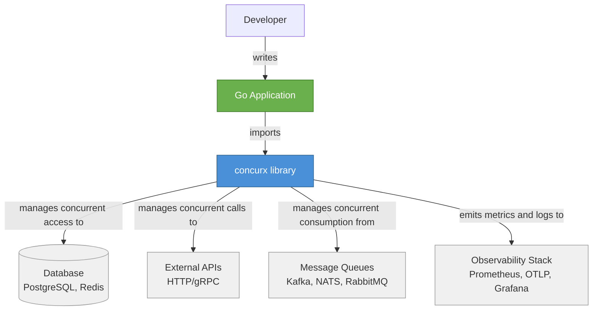
```mermaid
flowchart TB
    DEV["Developer"] -->|writes| APP["Go Application"]
    APP -->|imports| CONCURX["concurx library"]
    CONCURX -->|manages concurrent access to| DB[("Database\nPostgreSQL, Redis")]
    CONCURX -->|manages concurrent calls to| API["External APIs\nHTTP/gRPC"]
    CONCURX -->|manages concurrent consumption from| QUEUE["Message Queues\nKafka, NATS, RabbitMQ"]
    CONCURX -->|emits metrics and logs to| OBS["Observability Stack\nPrometheus, OTLP, Grafana"]

    style CONCURX fill:#4a90d9,color:#fff,stroke:#2c5f8a
    style APP fill:#6ab04c,color:#fff,stroke:#3d7a28
    style DB fill:#f0f0f0,stroke:#999
    style API fill:#f0f0f0,stroke:#999
    style QUEUE fill:#f0f0f0,stroke:#999
    style OBS fill:#f0f0f0,stroke:#999
```

**concurx** sits between the application and its external dependencies, managing concurrency, fault tolerance, and lifecycle for all concurrent operations.

---

## Internal Structure

The five building blocks inside concurx.

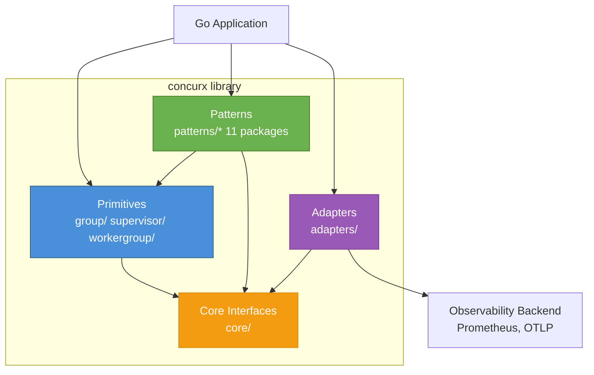
```mermaid
flowchart TB
    APP["Go Application"] --> PRIMS & PATS

    subgraph CONCURX ["concurx library"]
        PRIMS["Primitives\ngroup/ supervisor/ workergroup/"]
        PATS["Patterns\npatterns/* 11 packages"]
        CORE["Core Interfaces\ncore/"]
        ADAPT["Adapters\nadapters/"]

        PATS --> PRIMS
        PRIMS --> CORE
        PATS --> CORE
        ADAPT --> CORE
    end

    APP --> ADAPT
    ADAPT --> OBS["Observability Backend\nPrometheus, OTLP"]

    style PRIMS fill:#4a90d9,color:#fff,stroke:#2c5f8a
    style PATS fill:#6ab04c,color:#fff,stroke:#3d7a28
    style CORE fill:#f39c12,color:#fff,stroke:#d68910
    style ADAPT fill:#9b59b6,color:#fff,stroke:#7d3c98
```

| Container | Packages | Responsibility |
|-----------|----------|----------------|
| **Primitives** | `group/`, `supervisor/`, `workergroup/` | Low-level concurrency with deterministic guarantees |
| **Patterns** | `patterns/*` (11 packages) | Higher-level concurrency abstractions |
| **Core** | `core/` | Logger, Metrics, ErrorBoundary interfaces |
| **Adapters** | `adapters/` | Pluggable implementations (stdlib, Zap, Prometheus, OTel) |

---

## Primitives

The three core primitives and their dependencies.

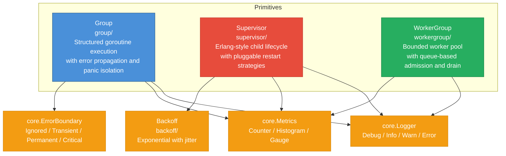
```mermaid
flowchart TB
    subgraph PRIMS ["Primitives"]
        GROUP["Group\ngroup/\nStructured goroutine execution\nwith error propagation and panic isolation"]
        SUPER["Supervisor\nsupervisor/\nErlang-style child lifecycle\nwith pluggable restart strategies"]
        WG["WorkerGroup\nworkergroup/\nBounded worker pool\nwith queue-based admission and drain"]
    end

    LOGGER["core.Logger\nDebug / Info / Warn / Error"]
    METRICS["core.Metrics\nCounter / Histogram / Gauge"]
    EB["core.ErrorBoundary\nIgnored / Transient / Permanent / Critical"]
    BACKOFF["Backoff\nbackoff/\nExponential with jitter"]

    GROUP --> LOGGER & METRICS & EB
    SUPER --> LOGGER & METRICS & BACKOFF
    WG --> LOGGER & METRICS

    style GROUP fill:#4a90d9,color:#fff,stroke:#2c5f8a
    style SUPER fill:#e74c3c,color:#fff,stroke:#c0392b
    style WG fill:#27ae60,color:#fff,stroke:#1e8449
    style LOGGER fill:#f39c12,color:#fff,stroke:#d68910
    style METRICS fill:#f39c12,color:#fff,stroke:#d68910
    style EB fill:#f39c12,color:#fff,stroke:#d68910
    style BACKOFF fill:#f39c12,color:#fff,stroke:#d68910
```

---

## Patterns Overview

How the 11 patterns relate to each other and to primitives.

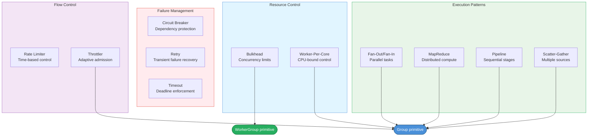
```mermaid
flowchart TB
    subgraph RC ["Resource Control"]
        BULK["Bulkhead\nConcurrency limits"]
        WPC["Worker-Per-Core\nCPU-bound control"]
    end

    subgraph FM ["Failure Management"]
        CB["Circuit Breaker\nDependency protection"]
        RETRY["Retry\nTransient failure recovery"]
        TIMEOUT["Timeout\nDeadline enforcement"]
    end

    subgraph FC ["Flow Control"]
        RATE["Rate Limiter\nTime-based control"]
        THROT["Throttler\nAdaptive admission"]
    end

    subgraph EP ["Execution Patterns"]
        FAN["Fan-Out/Fan-In\nParallel tasks"]
        MAP["MapReduce\nDistributed compute"]
        PIPE["Pipeline\nSequential stages"]
        SCAT["Scatter-Gather\nMultiple sources"]
    end

    GROUP(["Group primitive"])
    WGRP(["WorkerGroup primitive"])

    BULK --> WGRP
    FAN --> GROUP
    MAP --> GROUP
    PIPE --> GROUP
    SCAT --> GROUP
    THROT --> GROUP
    WPC --> GROUP

    style RC fill:#e1f5ff,stroke:#4a90d9
    style FM fill:#ffebee,stroke:#e74c3c
    style FC fill:#f3e5f5,stroke:#9b59b6
    style EP fill:#e8f5e8,stroke:#27ae60
    style GROUP fill:#4a90d9,color:#fff,stroke:#2c5f8a
    style WGRP fill:#27ae60,color:#fff,stroke:#1e8449
```

---

## Adapters and Observability

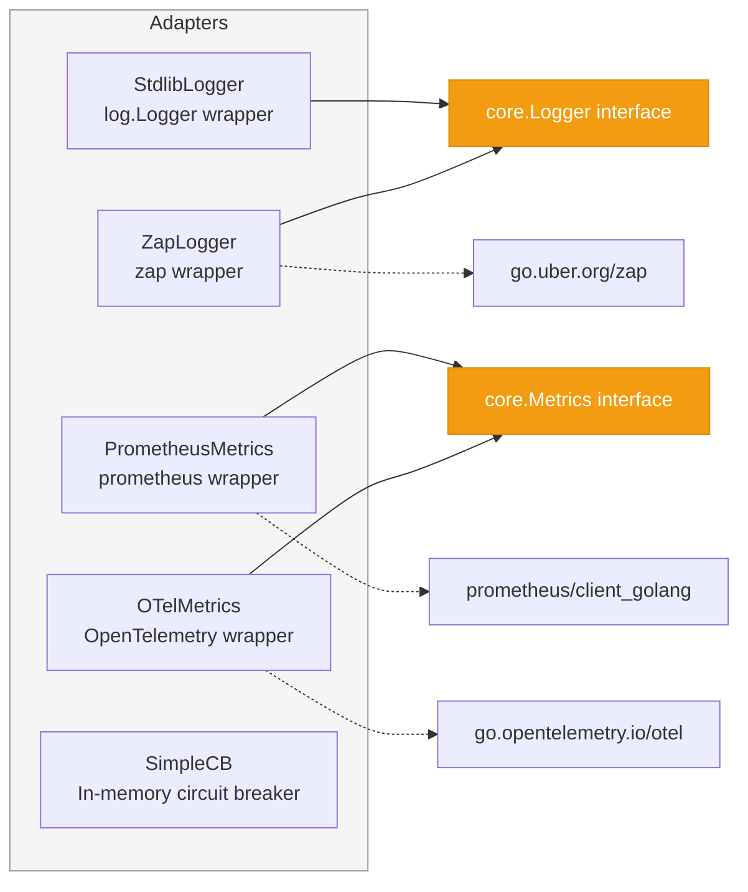
```mermaid
flowchart LR
    subgraph ADAPTERS ["Adapters"]
        STDLIB["StdlibLogger\nlog.Logger wrapper"]
        ZAP["ZapLogger\nzap wrapper"]
        PROM["PrometheusMetrics\nprometheus wrapper"]
        OTEL["OTelMetrics\nOpenTelemetry wrapper"]
        SCB["SimpleCB\nIn-memory circuit breaker"]
    end

    ILOG["core.Logger interface"]
    IMET["core.Metrics interface"]

    STDLIB --> ILOG
    ZAP --> ILOG
    PROM --> IMET
    OTEL --> IMET

    ZAP -.-> ZAPLIB["go.uber.org/zap"]
    PROM -.-> PROMLIB["prometheus/client_golang"]
    OTEL -.-> OTELLIB["go.opentelemetry.io/otel"]

    style ADAPTERS fill:#f5f5f5,stroke:#999
    style ILOG fill:#f39c12,color:#fff,stroke:#d68910
    style IMET fill:#f39c12,color:#fff,stroke:#d68910
```

### Metrics Emitted

| Primitive | Metrics |
|-----------|---------|
| **Group** | `concurx_group_goroutines_active`, `concurx_group_errors_total`, `concurx_group_panics_total` |
| **Supervisor** | `concurx_supervisor_children_active`, `concurx_supervisor_restarts_total`, `concurx_supervisor_backoff_duration_seconds` |
| **WorkerGroup** | `concurx_workergroup_jobs_queued`, `concurx_workergroup_jobs_completed_total`, `concurx_workergroup_workers_active` |

### Component Interaction Matrix

| Component | Uses Group | Uses Supervisor | Uses WorkerGroup | Provides Metrics | Provides Logging |
|-----------|-----------|----------------|-----------------|-----------------|-----------------|
| **Group** | - | No | No | Yes | Yes |
| **Supervisor** | No | Yes (children) | Yes (can manage) | Yes | Yes |
| **WorkerGroup** | No | No | - | Yes | Yes |
| **Pipeline** | Yes | No | No | No | No |
| **Fan-Out** | Yes | No | No | No | No |
| **MapReduce** | Yes | No | No | No | No |
| **Scatter-Gather** | Yes | No | No | No | No |
| **Bulkhead** | No | No | Yes | No | No |
| **Throttler** | Yes | No | No | No | No |
| **WorkerPerCore** | Yes | No | No | No | No |

---

# Part II: Runtime Flows

## Group Lifecycle

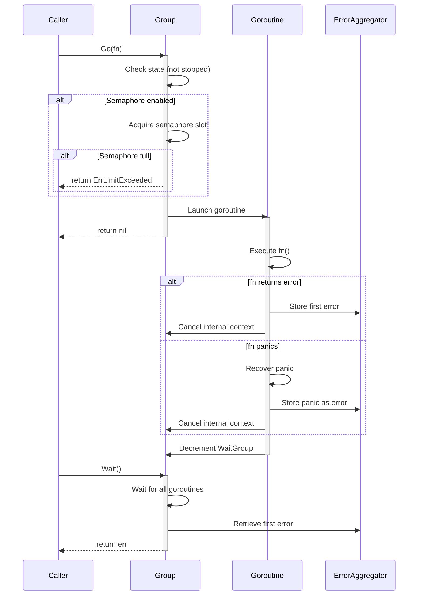
```mermaid
sequenceDiagram
    participant Caller
    participant Group
    participant Goroutine
    participant ErrorAggregator

    Caller->>Group: Go(fn)
    activate Group
    Group->>Group: Check state (not stopped)
    alt Semaphore enabled
        Group->>Group: Acquire semaphore slot
        alt Semaphore full
            Group-->>Caller: return ErrLimitExceeded
        end
    end
    Group->>Goroutine: Launch goroutine
    activate Goroutine
    Group-->>Caller: return nil
    deactivate Group

    Goroutine->>Goroutine: Execute fn()
    alt fn returns error
        Goroutine->>ErrorAggregator: Store first error
        Goroutine->>Group: Cancel internal context
    else fn panics
        Goroutine->>Goroutine: Recover panic
        Goroutine->>ErrorAggregator: Store panic as error
        Goroutine->>Group: Cancel internal context
    end
    Goroutine->>Group: Decrement WaitGroup
    deactivate Goroutine

    Caller->>Group: Wait()
    activate Group
    Group->>Group: Wait for all goroutines
    Group->>ErrorAggregator: Retrieve first error
    Group-->>Caller: return err
    deactivate Group
```

---

## Supervisor Restart

```mermaid
sequenceDiagram
    participant Supervisor
    participant Child
    participant Strategy
    participant Backoff

    Supervisor->>Child: Start(ctx, childFn)
    activate Child
    Child->>Child: Execute childFn()
    Child--xChild: Error / Exit
    deactivate Child

    Child->>Supervisor: Error notification
    activate Supervisor
    Supervisor->>Strategy: OnFailure(childID, err, attempt)
    activate Strategy
    Strategy->>Strategy: Check restart decision
    alt Should restart
        Strategy->>Backoff: computeBackoff(attempt, config)
        activate Backoff
        Backoff->>Backoff: Exponential delay with jitter
        Backoff-->>Strategy: delay duration
        deactivate Backoff
        Strategy-->>Supervisor: Restart with delay
        deactivate Strategy
        alt delay > 0
            Supervisor->>Supervisor: time.Sleep(delay)
        end
        Supervisor->>Child: Start(ctx, childFn)
        activate Child
    else Should not restart
        Strategy-->>Supervisor: Stop
        deactivate Strategy
        Supervisor->>Supervisor: Mark child stopped
    end
    deactivate Supervisor
```

---

## WorkerGroup Drain

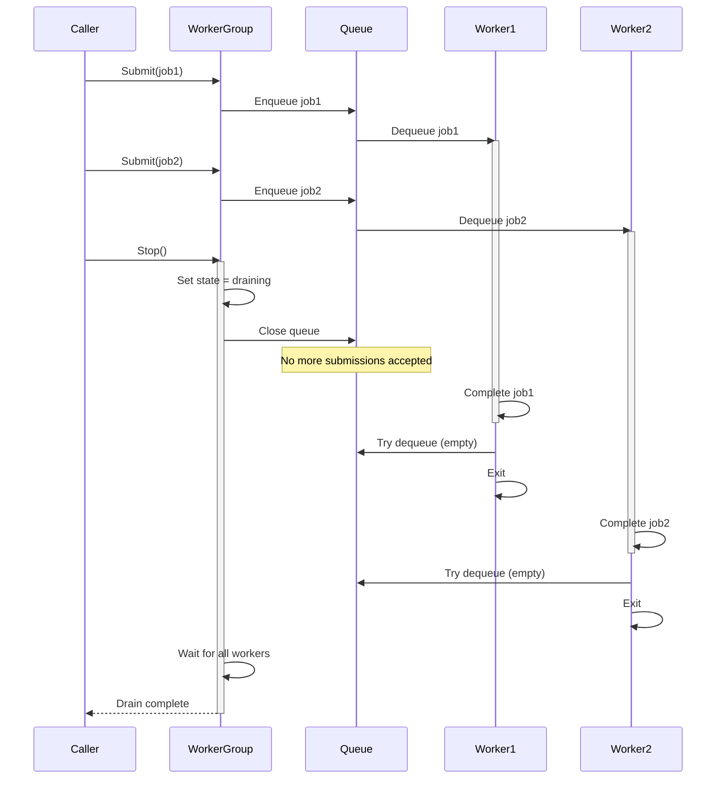
```mermaid
sequenceDiagram
    participant Caller
    participant WorkerGroup
    participant Queue
    participant Worker1
    participant Worker2

    Caller->>WorkerGroup: Submit(job1)
    WorkerGroup->>Queue: Enqueue job1
    Queue->>Worker1: Dequeue job1
    activate Worker1

    Caller->>WorkerGroup: Submit(job2)
    WorkerGroup->>Queue: Enqueue job2
    Queue->>Worker2: Dequeue job2
    activate Worker2

    Caller->>WorkerGroup: Stop()
    activate WorkerGroup
    WorkerGroup->>WorkerGroup: Set state = draining
    WorkerGroup->>Queue: Close queue
    Note over Queue: No more submissions accepted

    Worker1->>Worker1: Complete job1
    deactivate Worker1
    Worker1->>Queue: Try dequeue (empty)
    Worker1->>Worker1: Exit

    Worker2->>Worker2: Complete job2
    deactivate Worker2
    Worker2->>Queue: Try dequeue (empty)
    Worker2->>Worker2: Exit

    WorkerGroup->>WorkerGroup: Wait for all workers
    WorkerGroup-->>Caller: Drain complete
    deactivate WorkerGroup
```

---

## Pipeline Stages

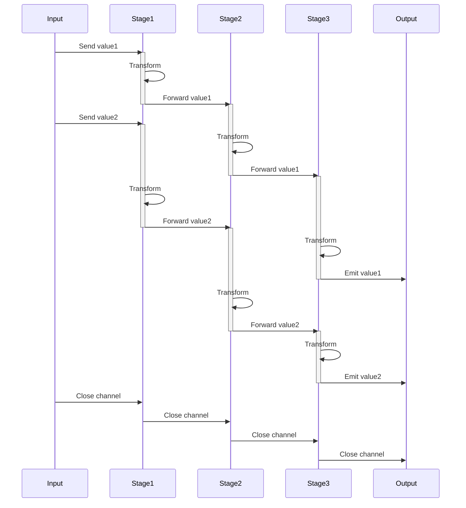
```mermaid
sequenceDiagram
    participant Input
    participant Stage1
    participant Stage2
    participant Stage3
    participant Output

    Input->>Stage1: Send value1
    activate Stage1
    Stage1->>Stage1: Transform
    Stage1->>Stage2: Forward value1
    deactivate Stage1
    activate Stage2

    Input->>Stage1: Send value2
    activate Stage1
    Stage2->>Stage2: Transform
    Stage2->>Stage3: Forward value1
    deactivate Stage2
    activate Stage3

    Stage1->>Stage1: Transform
    Stage1->>Stage2: Forward value2
    deactivate Stage1
    activate Stage2

    Stage3->>Stage3: Transform
    Stage3->>Output: Emit value1
    deactivate Stage3

    Stage2->>Stage2: Transform
    Stage2->>Stage3: Forward value2
    deactivate Stage2
    activate Stage3

    Stage3->>Stage3: Transform
    Stage3->>Output: Emit value2
    deactivate Stage3

    Input->>Stage1: Close channel
    Stage1->>Stage2: Close channel
    Stage2->>Stage3: Close channel
    Stage3->>Output: Close channel
```

---

# Part III: Pattern Catalog

## Pattern Selection Guide

| I need to... | Use this pattern | Primary benefit |
|--------------|-----------------|-----------------|
| Limit concurrent resource access | [Bulkhead](#bulkhead) | Resource protection |
| Stop calls to failing services | [Circuit Breaker](#circuit-breaker) | Failure isolation |
| Run tasks in parallel | [Fan-Out/Fan-In](#fan-out--fan-in) | Parallel execution |
| Parallel compute + aggregate | [MapReduce](#mapreduce) | Distributed computation |
| Stream through ordered stages | [Pipeline](#pipeline) | Sequential processing |
| Control request rate over time | [Rate Limiter](#rate-limiter) | Rate control |
| Retry transient failures | [Retry](#retry) | Failure recovery |
| Query multiple sources | [Scatter-Gather](#scatter-gather) | Redundancy and speed |
| Dynamic admission control | [Throttler](#throttler) | Adaptive control |
| Enforce execution deadlines | [Timeout](#timeout) | Deadline management |
| Pin work to CPU cores | [Worker-Per-Core](#worker-per-core) | CPU-bound control |

### Anti-Patterns

| Don't do this | Do this instead |
|---------------|----------------|
| Use Retry to limit load | Use Bulkhead or Throttler |
| Use RateLimiter for concurrency | Use Bulkhead |
| Use WorkerPerCore for I/O | Use Bulkhead |
| Use Pipeline for batching | Use MapReduce |
| Use ScatterGather for streaming | Use Pipeline |

### Pattern Complexity

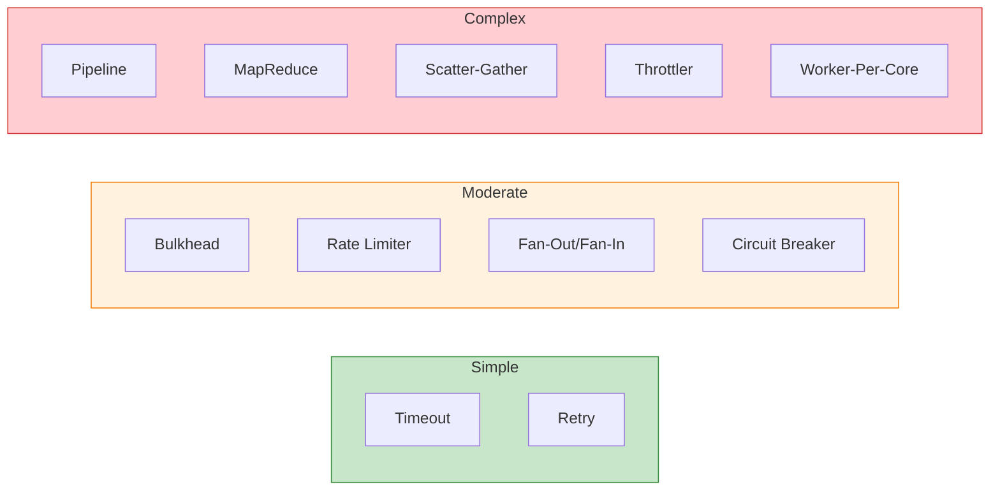
```mermaid
flowchart LR
    subgraph Simple
        S1["Timeout"]
        S2["Retry"]
    end
    subgraph Moderate
        M1["Bulkhead"]
        M2["Rate Limiter"]
        M3["Fan-Out/Fan-In"]
        M4["Circuit Breaker"]
    end
    subgraph Complex
        C1["Pipeline"]
        C2["MapReduce"]
        C3["Scatter-Gather"]
        C4["Throttler"]
        C5["Worker-Per-Core"]
    end

    style Simple fill:#c8e6c9,stroke:#388e3c
    style Moderate fill:#fff3e0,stroke:#f57c00
    style Complex fill:#ffcdd2,stroke:#d32f2f
```

---

## Bulkhead

Protect shared resources by enforcing hard concurrency limits.

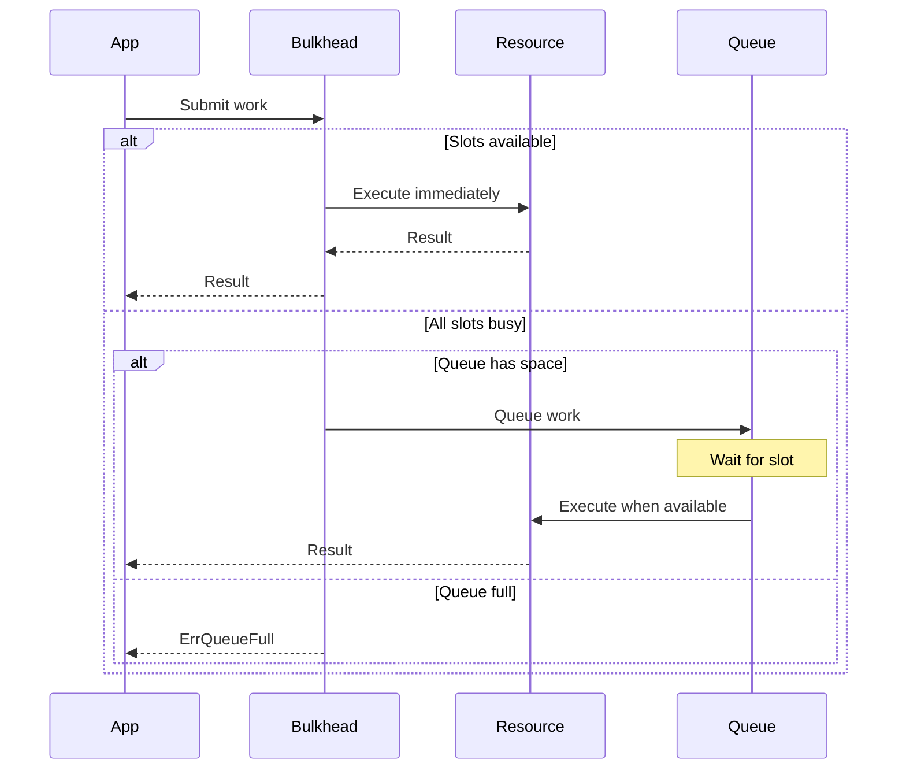
```mermaid
sequenceDiagram
    participant App
    participant Bulkhead
    participant Resource
    participant Queue

    App->>Bulkhead: Submit work

    alt Slots available
        Bulkhead->>Resource: Execute immediately
        Resource-->>Bulkhead: Result
        Bulkhead-->>App: Result
    else All slots busy
        alt Queue has space
            Bulkhead->>Queue: Queue work
            Note over Queue: Wait for slot
            Queue->>Resource: Execute when available
            Resource-->>App: Result
        else Queue full
            Bulkhead-->>App: ErrQueueFull
        end
    end
```

**When to use:** Limit concurrent DB connections, control concurrent HTTP requests, prevent resource exhaustion, isolate workload types.

```go
dbBulkhead := bulkhead.New(bulkhead.Config{
    MaxConcurrency: 5,
    QueueSize:      20,
    SubmitBehavior: bulkhead.SubmitBlock,
})

result, err := dbBulkhead.Execute(ctx, func(ctx context.Context) (interface{}, error) {
    return queryDatabase(ctx, "SELECT * FROM users")
})
```

---

## Circuit Breaker

Stop calls to a degraded service and fail fast, giving it time to recover.

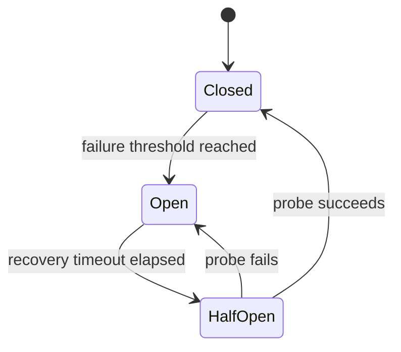
```mermaid
stateDiagram-v2
    [*] --> Closed
    Closed --> Open : failure threshold reached
    Open --> HalfOpen : recovery timeout elapsed
    HalfOpen --> Closed : probe succeeds
    HalfOpen --> Open : probe fails
```

**When to use:** Protect against cascading failures, wrap calls to unreliable downstream services, prevent resource exhaustion from repeated failing calls.

```go
cb := circuitbreaker.New(circuitbreaker.Config{
    FailureThreshold: 5,
    RecoveryTimeout:  30 * time.Second,
})

result, err := cb.Execute(ctx, func(ctx context.Context) (interface{}, error) {
    return callDownstreamService(ctx)
})
```

---

## Fan-Out / Fan-In

Execute multiple independent tasks in parallel and aggregate results.

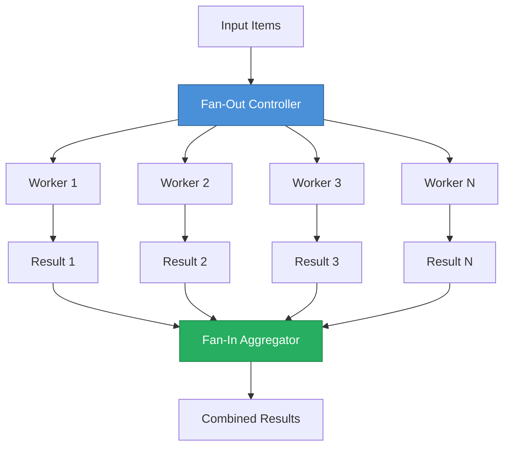
```mermaid
flowchart TD
    INPUT["Input Items"] --> FANOUT["Fan-Out Controller"]

    FANOUT --> W1["Worker 1"] --> R1["Result 1"]
    FANOUT --> W2["Worker 2"] --> R2["Result 2"]
    FANOUT --> W3["Worker 3"] --> R3["Result 3"]
    FANOUT --> WN["Worker N"] --> RN["Result N"]

    R1 & R2 & R3 & RN --> FANIN["Fan-In Aggregator"]
    FANIN --> OUT["Combined Results"]

    style FANOUT fill:#4a90d9,color:#fff,stroke:#2c5f8a
    style FANIN fill:#27ae60,color:#fff,stroke:#1e8449
```

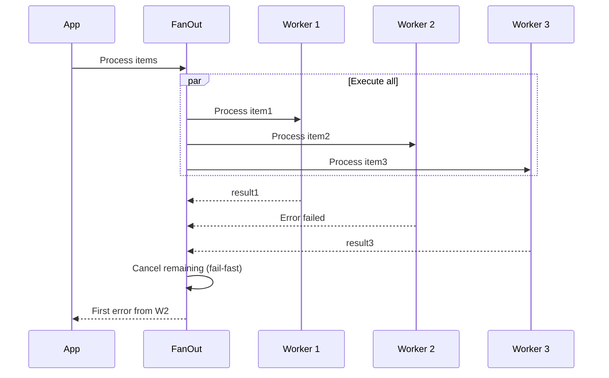
```mermaid
sequenceDiagram
    participant App
    participant FanOut
    participant W1 as Worker 1
    participant W2 as Worker 2
    participant W3 as Worker 3

    App->>FanOut: Process items

    par Execute all
        FanOut->>W1: Process item1
        FanOut->>W2: Process item2
        FanOut->>W3: Process item3
    end

    W1-->>FanOut: result1
    W2-->>FanOut: Error failed
    W3-->>FanOut: result3

    FanOut->>FanOut: Cancel remaining (fail-fast)
    FanOut-->>App: First error from W2
```

**When to use:** Parallel HTTP requests, concurrent file processing, multi-source data gathering.

```go
results, err := fanoutin.Run(ctx, urls, func(ctx context.Context, url string) (string, error) {
    resp, err := http.Get(url)
    if err != nil {
        return "", err
    }
    defer resp.Body.Close()
    body, err := io.ReadAll(resp.Body)
    return string(body), err
})
```

---

## MapReduce

Parallel map with result aggregation via a reduce function.

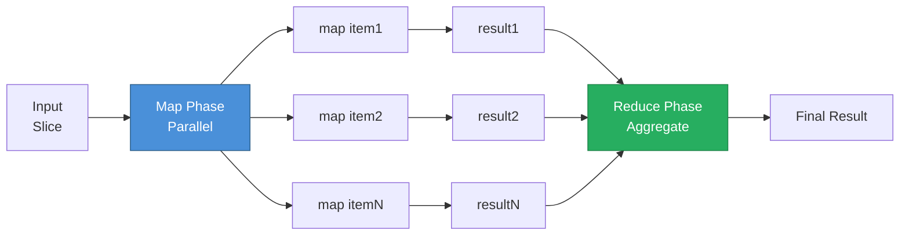
```mermaid
flowchart LR
    INPUT["Input\nSlice"] --> MAP["Map Phase\nParallel"]
    MAP --> M1["map item1"] --> R1["result1"]
    MAP --> M2["map item2"] --> R2["result2"]
    MAP --> MN["map itemN"] --> RN["resultN"]
    R1 & R2 & RN --> REDUCE["Reduce Phase\nAggregate"]
    REDUCE --> OUTPUT["Final Result"]

    style MAP fill:#4a90d9,color:#fff,stroke:#2c5f8a
    style REDUCE fill:#27ae60,color:#fff,stroke:#1e8449
```

**When to use:** Analytics, aggregation, distributed computation.

```go
total, err := mapreduce.Run(ctx, items,
    func(ctx context.Context, item Item) (int, error) { return item.Value, nil },
    func(results []int) int {
        sum := 0
        for _, v := range results { sum += v }
        return sum
    },
)
```

---

## Pipeline

Stream data through ordered processing stages with backpressure.

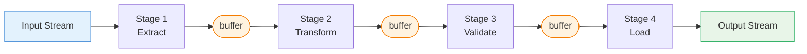
```mermaid
flowchart LR
    IN["Input Stream"] --> S1["Stage 1\nExtract"]
    S1 --> B1(["buffer"])
    B1 --> S2["Stage 2\nTransform"]
    S2 --> B2(["buffer"])
    B2 --> S3["Stage 3\nValidate"]
    S3 --> B3(["buffer"])
    B3 --> S4["Stage 4\nLoad"]
    S4 --> OUT["Output Stream"]

    style IN fill:#e3f2fd,stroke:#4a90d9
    style OUT fill:#e8f5e8,stroke:#27ae60
    style B1 fill:#fff3e0,stroke:#f57c00
    style B2 fill:#fff3e0,stroke:#f57c00
    style B3 fill:#fff3e0,stroke:#f57c00
```

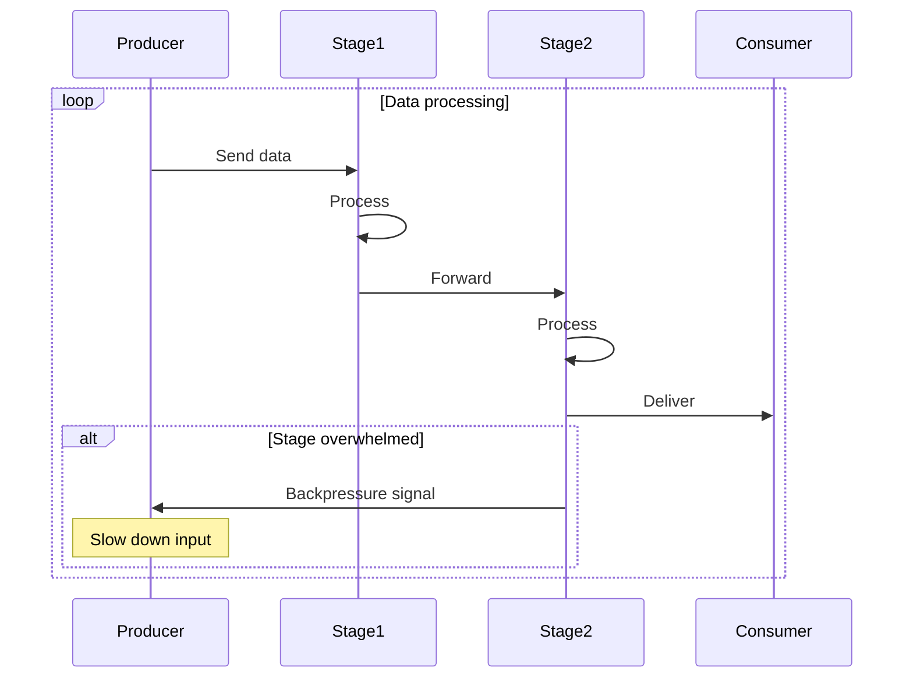
```mermaid
sequenceDiagram
    participant Producer
    participant Stage1
    participant Stage2
    participant Consumer

    loop Data processing
        Producer->>Stage1: Send data
        Stage1->>Stage1: Process
        Stage1->>Stage2: Forward
        Stage2->>Stage2: Process
        Stage2->>Consumer: Deliver

        alt Stage overwhelmed
            Stage2->>Producer: Backpressure signal
            Note over Producer: Slow down input
        end
    end
```

**When to use:** ETL, image/video processing, data transformation chains, streaming.

```go
p := pipeline.New()
result, err := p.Execute(ctx, rawInput, extract, transform, load)
```

---

## Rate Limiter

Token-bucket admission control controls request rate over time.

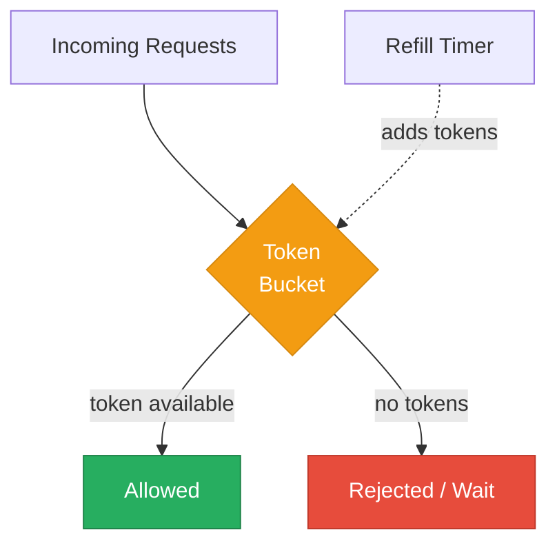
```mermaid
flowchart TD
    REQ["Incoming Requests"] --> BUCKET{"Token\nBucket"}
    BUCKET -->|token available| ALLOW["Allowed"]
    BUCKET -->|no tokens| DENY["Rejected / Wait"]
    REFILL["Refill Timer"] -.->|adds tokens| BUCKET

    style BUCKET fill:#f39c12,color:#fff,stroke:#d68910
    style ALLOW fill:#27ae60,color:#fff,stroke:#1e8449
    style DENY fill:#e74c3c,color:#fff,stroke:#c0392b
```

**When to use:** API rate limiting, controlling throughput to downstream services. Differs from Throttler: Rate Limiter enforces a fixed rate; Throttler uses policy-driven adaptive admission.

---

## Retry

Exponential backoff for transient failures.

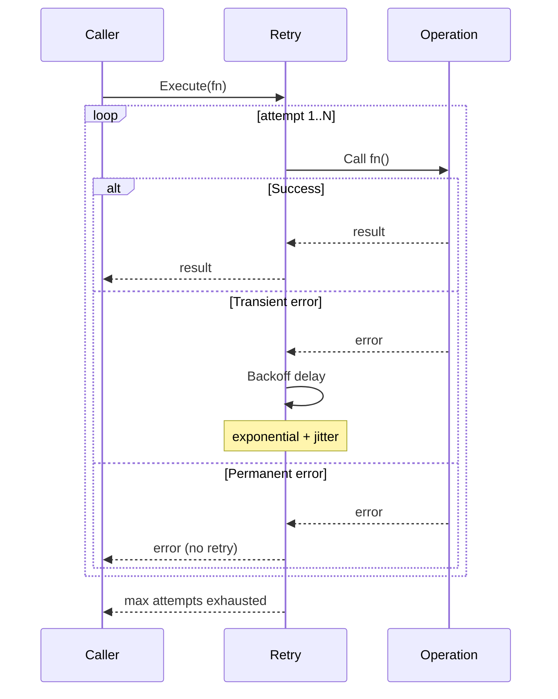
```mermaid
sequenceDiagram
    participant Caller
    participant Retry
    participant Operation

    Caller->>Retry: Execute(fn)
    loop attempt 1..N
        Retry->>Operation: Call fn()
        alt Success
            Operation-->>Retry: result
            Retry-->>Caller: result
        else Transient error
            Operation-->>Retry: error
            Retry->>Retry: Backoff delay
            Note over Retry: exponential + jitter
        else Permanent error
            Operation-->>Retry: error
            Retry-->>Caller: error (no retry)
        end
    end
    Retry-->>Caller: max attempts exhausted
```

**When to use:** Network calls, transient I/O failures, flaky service dependencies.

```go
result, err := retry.Execute(ctx, retry.Config{
    MaxAttempts: 3,
    Backoff:     backoff.Exponential(100*time.Millisecond, 5*time.Second),
}, operation)
```

---

## Scatter-Gather

Execute the same operation against multiple sources and aggregate by policy.

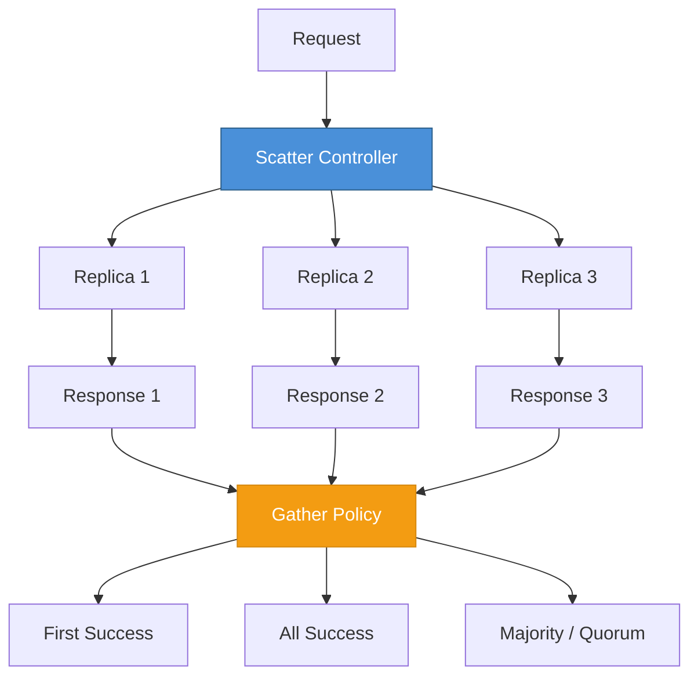
```mermaid
flowchart TD
    REQ["Request"] --> SC["Scatter Controller"]

    SC --> R1["Replica 1"]
    SC --> R2["Replica 2"]
    SC --> R3["Replica 3"]

    R1 --> RESP1["Response 1"]
    R2 --> RESP2["Response 2"]
    R3 --> RESP3["Response 3"]

    RESP1 & RESP2 & RESP3 --> GATHER["Gather Policy"]

    GATHER --> P1["First Success"]
    GATHER --> P2["All Success"]
    GATHER --> P3["Majority / Quorum"]

    style SC fill:#4a90d9,color:#fff,stroke:#2c5f8a
    style GATHER fill:#f39c12,color:#fff,stroke:#d68910
```

```mermaid
sequenceDiagram
    participant Client
    participant SG as ScatterGather
    participant S1 as Service 1
    participant S2 as Service 2
    participant S3 as Service 3

    Client->>SG: Query data

    par Scatter
        SG->>S1: Query
        SG->>S2: Query
        SG->>S3: Query
    end

    S1-->>SG: data1
    S2-->>SG: timeout error
    S3-->>SG: data3

    Note over SG: Policy FirstSuccess
    SG->>SG: Cancel remaining
    SG-->>Client: Return data1
```

**When to use:** Multi-region queries, quorum reads, A/B testing, geographic load balancing.

```go
result, err := scattergather.FirstSuccess(ctx, endpoints,
    func(ctx context.Context, ep string) (Data, error) {
        return fetchFromEndpoint(ctx, ep)
    },
)
```

---

## Throttler

Policy-driven adaptive admission control. Unlike Rate Limiter (fixed rate), Throttler dynamically adjusts admission based on configurable policies.

```mermaid
flowchart TD
    REQ["Incoming Work"] --> POLICY{"Admission\nPolicy"}
    POLICY -->|admitted| EXEC["Execute via Group"]
    POLICY -->|rejected| REJECT["Rejected"]
    FEEDBACK["Execution Result"] -.->|feedback loop| POLICY

    style POLICY fill:#9b59b6,color:#fff,stroke:#7d3c98
    style EXEC fill:#27ae60,color:#fff,stroke:#1e8449
    style REJECT fill:#e74c3c,color:#fff,stroke:#c0392b
```

**When to use:** Adaptive load shedding, dynamic concurrency control, systems that need to react to runtime conditions.

---

## Timeout

Context deadline enforcement with panic isolation.

```mermaid
sequenceDiagram
    participant Caller
    participant Timeout
    participant Operation
    participant Timer

    Caller->>Timeout: Execute(fn, duration)
    Timeout->>Timer: Start timer
    Timeout->>Operation: Run fn in goroutine
    activate Operation

    alt Operation completes in time
        Operation-->>Timeout: result
        Timeout->>Timer: Cancel timer
        Timeout-->>Caller: result
    else Timer fires first
        Timer-->>Timeout: Deadline exceeded
        Timeout-->>Caller: ErrTimeout
        Note over Operation: Still running but result discarded
        deactivate Operation
    end
```

**When to use:** Enforce SLA deadlines, prevent slow operations from blocking, wrap unreliable calls.

---

## Worker-Per-Core

Pin exactly one worker per CPU core for CPU-bound parallelism.

```mermaid
flowchart TD
    JOBS["Input Jobs"] --> QUEUE["Job Queue\nSize: N x NumCPU"]

    subgraph CORES ["CPU Cores"]
        C1["Core 1"] --- W1["Worker 1"]
        C2["Core 2"] --- W2["Worker 2"]
        C3["Core 3"] --- W3["Worker 3"]
        C4["Core N"] --- WN["Worker N"]
    end

    QUEUE --> W1 & W2 & W3 & WN

    style CORES fill:#e8f5e8,stroke:#388e3c
    style QUEUE fill:#fff3e0,stroke:#f57c00
```

**When to use:** CPU-intensive computation, image processing, cryptographic operations, data compression.

```go
pool := workerpercore.New(workerpercore.Config{
    QueueSize: runtime.NumCPU() * 10,
})
defer pool.Stop()

pool.Submit(ctx, func(ctx context.Context) error {
    return performHeavyComputation(taskID)
})
```

---

## Pattern Composition

Patterns compose by nesting. Outer pattern controls admission; inner pattern runs the operation.

```mermaid
flowchart TD
    subgraph SAFE ["Safe External API Call"]
        direction LR
        A1["Request"] --> B1["Timeout"] --> C1["Bulkhead"] --> D1["Retry"] --> E1["Circuit Breaker"] --> F1["HTTP Client"]
    end

    subgraph DATA ["Resilient Data Processing"]
        direction LR
        A2["Data Stream"] --> B2["Pipeline"] --> C2["Worker-Per-Core"] --> D2["Fan-Out/Fan-In"] --> E2["Result"]
    end

    subgraph MULTI ["Multi-Region Service"]
        direction LR
        A3["Query"] --> B3["Scatter-Gather"] --> C3["Timeout"] --> D3["Bulkhead"] --> E3["Service Replicas"]
    end
```

```go
// Resilient HTTP client composing four patterns
func (c *Client) Get(ctx context.Context, url string) (*http.Response, error) {
    return c.timeout.Execute(ctx, func(ctx context.Context) (*http.Response, error) {
        return c.bulkhead.Execute(ctx, func(ctx context.Context) (*http.Response, error) {
            return c.retry.Execute(ctx, func(ctx context.Context) (*http.Response, error) {
                return c.circuitBreaker.Execute(ctx, func(ctx context.Context) (*http.Response, error) {
                    req, _ := http.NewRequestWithContext(ctx, "GET", url, nil)
                    return c.client.Do(req)
                })
            })
        })
    })
}
```

---

# Part IV: Design

## Design Decisions

### 1. Why Three Primitives?

Expose `Group`, `Supervisor`, and `WorkerGroup` as independent primitives instead of a single unified type. Each has distinct lifecycle semantics that don't compose cleanly. Combining them would create a "god object" with configuration matrix explosion.

### 2. Why No Global State?

No global registries, no singleton supervisors. Users wire dependencies explicitly. This makes the library testable, predictable, and concurrency-safe.

### 3. Why Drain-on-Stop?

`Stop()` blocks until all accepted work completes. Production systems need graceful shutdown for cleanup. If a job needs to be cancellable, users pass a cancellable context into the job function.

### 4. Why Interface-Based Observability?

`core.Logger` and `core.Metrics` are interfaces. Zero dependency by default. Users bring their own logger and metrics backend.

### 5. Why Patterns as Separate Packages?

Each pattern is a standalone package for discoverability, composability, and isolated testing. `import "github.com/abhipray-cpu/concurx/patterns/retry"` is explicit.

### 6. Why No Callbacks for Group.Go()?

Callbacks introduce non-deterministic ordering. Error aggregation is handled by `Wait()`. Users write imperative code after `Wait()` instead of declarative callbacks.

---

## Guarantees

| # | Guarantee | Mechanism |
|---|-----------|-----------|
| 1 | **No goroutine leaks** | Every goroutine decrements a WaitGroup. Stop() waits for zero. |
| 2 | **Panic isolation** | Every goroutine has `defer recover()`. Panics become errors. |
| 3 | **First-error-wins** | `sync.Once` stores first error. Context cancelled on first error. |
| 4 | **Deterministic shutdown** | Queue closed on Stop(). WaitGroup.Wait() blocks until drain. |
| 5 | **Race-free operations** | Atomics for state, mutexes for data, channels for coordination. |
| 6 | **Context propagation** | Cancellation stops admission, not running work. |

### Lifecycle State Machine

All primitives follow:

```
Idle --> Running --> Draining --> Stopped
```

- Transitions are **one-way** and **irreversible**
- State changes are **atomic**
- `Stop()` is **idempotent**

---

## Best Practices

**Do:**
- Always `defer wg.Stop()` and `defer s.Wait()`
- Use `context.WithTimeout` for all external calls
- Choose submit behavior intentionally (`SubmitBlock` vs `SubmitReject`)
- Compose patterns outer-to-inner: `timeout -> bulkhead -> retry -> circuit breaker -> operation`
- Handle pattern-specific errors (`ErrQueueFull`, `ErrCircuitOpen`, `ErrTimeout`)

**Don't:**
- Use Retry for load control (use Bulkhead)
- Expect cancellation to kill accepted work (it stops admission only)
- Nest more than 3-4 patterns deep (extract to helper methods)
- Ignore returned errors from `Submit()` or `Go()`
- Use `go func(){}()` directly (use concurx primitives)

---

## Navigation

- [Main Documentation](../README.md)
- [Usage Guide](USAGE.md) -- API reference, examples, and common pitfalls
- [Contributing Guide](../CONTRIBUTING.md) -- Development guidelines

---

**Document Version**: 4.0 (Unified Architecture + Patterns)
**Last Updated**: February 2026
**Maintained By**: concurx contributors
